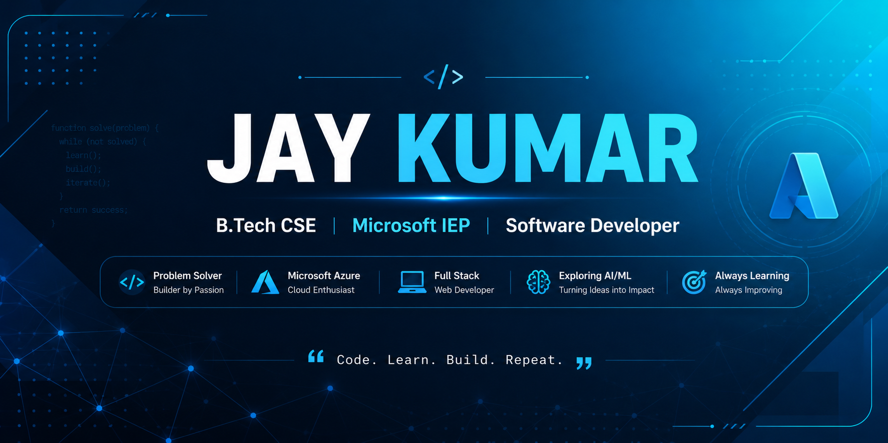

  

# 👋 Hi, I'm Jay Kumar

### B.Tech CSE Student | Microsoft IEP | Software Developer

💻 Passionate about Software Development, Web Development & AI/ML  
☁️ Exploring Microsoft Azure & Cloud Technologies  
🧩 Learning Data Structures & Algorithms  
🚀 Building projects and participating in hackathons

---

## 🚀 About Me

- 🎓 B.Tech Computer Science & Engineering
- 💻 Interested in Software Development & Web Development
- 🧠 Currently learning DSA with C++
- ☁️ Exploring Microsoft Azure
- 🤖 Interested in AI/ML
- 🚀 Building projects and improving my development skills
- 🌱 Always learning something new

---

<h2>🛠️ Tech Stack</h2>

  

---

## 📊 GitHub Stats

  
  

  

---

## 🚀 Featured Projects

### 🧠 NeuroPath-AI
AI/ML based healthcare prioritization project with explainability.

### 🎓 Alumni Platform
A platform designed to connect students and alumni.

### 🧮 Avengers Calculator
A web-based calculator project.

### 🍽️ Restaurant Website
A responsive restaurant website project.

### 💻 DSA & LeetCode
My journey of practicing Data Structures & Algorithms.

---

## 📚 Currently Learning

- Data Structures & Algorithms
- Java
- React
- AI/ML
- Microsoft Azure
- System Design

---

## 🤝 Connect With Me

[LinkedIn](YOUR_LINKEDIN_URL) • [GitHub](https://github.com/Jaykumar026)
